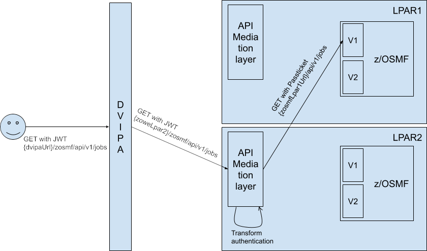

# Routing

Learn more about the different ways the API Mediation Layer works together with the southbound services to route
the user's requests.

API Mediation Layer provides API Gateway service. The service serves as Level 7 Load Balancer, accepting the requests, 
understanding, validating and tranforming authentication and handling other concerns like observability for all the 
services onboarded. To do so, the API Gateway needs to route the accepted requests to the relevant service, it's instance
in the right place, that is accepting connections. 


## Terminology

* **Service**

  A service provides one or more APIs, and is identified by a service ID. Note that sometimes the term "service name" is
  used to mean service ID.

  The default service ID is provided by the service developer in the service configuration file.

  A system administrator can replace the service ID with a deployment environment specific name using additional
  configuration that is external to the service deployment unit. Most often, this is configured in a JAR or WAR file. 
  Explain how to do that in your documentation of the specific service. 

  Services are deployed using one or more service instances, which share the same service ID and implementation.

* **Instance**

  Instance of a specific service providing one or more APIs.

### Single API Mediation Layer Instance

When there is one instance of the API Mediation Layer in the system, we expect the API Mediation Layer to be the
entry point to the system.

#### Single instance of service

The service can be deployed with one instance or with multiple instances. The service exposes APIs, these APIs may
be versioned.

##### One version of the API


##### Multiple version of the API


#### Multiple instances of service


### Multiple API Mediation Layer Instances

This reflects the High Availability setup for the API Mediation Layer, where L5 load balancer in front of the 
API Gateway is used. 

#### Same LPAR Multiple API Mediation Layer Instances


#### Different LPAR Multiple API Mediation Layer Instances



## APIML Basic Routing (using Service ID and version)

This method of basic routing is based on the service ID that identifies the service. The specific instance is selected
by the API Gateway. All instances require an identical response.

The URI identifies the resource, but does not identify the instance of the service as unique when multiple instances of
the same service are provided. For example, when a service is running in high-availability (HA) mode.

In addition to the basic Zuul routing, the Zowe API Gateway supports versioning in which you can specify a major
version. The Gateway routes a request only to an instance that provides the specified major version of the API.

The `/api/` prefix is used for REST APIs. The prefix `/ui/` applies to web UIs and the prefix `/ws/` applies
to [WebSockets](websocket.md) `/graphql/` applies to GraphQL APIs.

The URL format expected by the API Gateway is:

`https://{gatewayHost}:{port}/{serviceId}/api/v{majorVersion}/{resource}`

**Example:**

The following address shows the original URL of a resource exposed by a service:

```
http://service:10015/enablerv1sampleapp/api/v1/samples
```

The following address shows the API Gateway URL of the resource:

```
https://gateway:10010/enablerv1sampleapp/api/v1/samples
```

The following diagram illustrates how basic routing works:


### Implementation Details

Service instances provide information about routing to the API Gateway via Eureka metadata.

**Example:**

    metadata-map:
        apiml:
            routes:
                ui_v1:
                    gatewayUrl: "ui/v1"
                    serviceUrl: "/helloworld"
                api_v1:
                    gatewayUrl: "api/v1"
                    serviceUrl: "/helloworld/v1"
                api_v2:
                    gatewayUrl: "api/v2"
                    serviceUrl: "/helloworld/v2"

In this example, the service has a service ID of `helloworldservice` that exposes the following endpoints:

* **UI** - `https://gateway/helloworldservice/ui/v1` routed to `https://hwServiceHost:port/helloworld/`
* **API major version 1** - `https://gateway/helloworldservice/api/v1` routed
  to `https://hwServiceHost:port/helloworld/v1`
* **API major version 2** - `https://gateway/helloworldservice/api/v2` routed
  to `https://hwServiceHost:port/helloworld/v2`

where:

* The gatewayUrl is matched against the prefix of the URL path used at the Gateway `https://gateway/urlPath`,
  where `urlPath` is `serviceId/prefix/resourcePath`.
* The service ID is used to find the service host and port.
* The `serviceUrl` is used to prefix the `resourcePath` at the service host.

**Note:** The service ID is not included in the routing metadata, but the service ID is in the basic Eureka metadata.

### Basic Routing (using only the service ID)

One example that only uses a service ID is z/OSMF.

**Example:**

z/OSMF URL through the Gateway: `https://gateway:10010/zosmf/api/restjobs/jobs/...`

where:

* `zosmf` is the service ID.
* `/restjobs/1.0/...` is the rest of the endpoint segment.

Note that no version is specified in this URL.