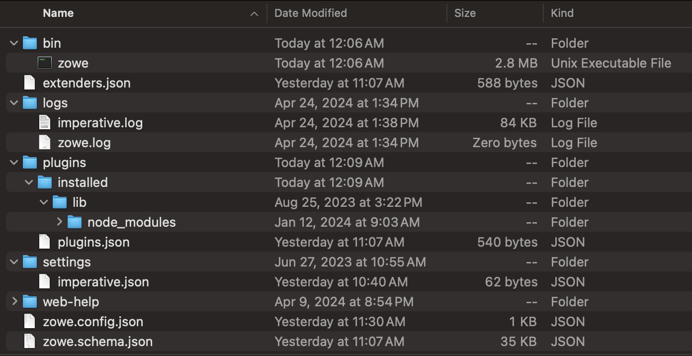

# Using individual commands for Zowe CLI troubleshooting

Follow these instructions to gather specific pieces of information to help troubleshoot Zowe&trade; CLI issues.

## Identify the currently installed CLI version

Issue the following command:

```
zowe -V
```

The exact Zowe CLI version may vary depending upon if the `@latest`, `@zowe-v1-lts`, `@zowe-v2-lts`, or `@zowe-v3-lts` version is installed.

Display the version of your globally-installed Zowe CLI through the following NPM command:

```
npm list -g @zowe/cli
```

More information regarding versioning conventions for Zowe CLI and plug-ins is located in [Zowe CLI Releases](https://github.com/zowe/zowe-cli/blob/1ec04a68c7b86acebc26e2af834ce48192794ea0/RELEASE_HISTORY.md).

## Identify the currently installed versions of plug-ins

Issue the following command:

```
zowe plugins list
```

The output includes the plug-in version number and registry information.

## Environment variables

The following settings are configurable with environment variables:

### Log levels

Environment variables are available to specify logging level and the CLI home directory.

:::warning

Setting the log level to `TRACE` or `ALL` might result in sensitive data being logged. For example, command line arguments will be logged when `TRACE` is set.

:::

For more information about logging and environment variables, see [Setting CLI log levels](../../user-guide/cli-configuringcli-ev.md#setting-cli-log-levels). 

### CLI daemon mode

By default, the CLI daemon mode binary creates or reuses a file in the user's home directory each time a Zowe CLI command runs. In some cases, this behavior might be undesirable. One example of this would be when the home directory resides on a network drive and has poor file performance. In this case, changing the file location would improve performance time.

For information about how to change the location that the daemon uses, see [Setting CLI daemon mode properties](../../user-guide/cli-configuringcli-ev#setting-cli-daemon-mode-properties).

### Home directory

You can set the location on your computer for the Zowe CLI home directory, which contains log files, profiles, and plug-ins for the product.

The default `.zowe` folder is created when you issue your first Zowe CLI command. If you change the location of the folder, you must reinstall plug-ins and recreate or move profiles and log files that you want to retain. In some cases, you might want to maintain a different set of profiles in multiple folders, then switch between them using the environment variable.

For information about setting an environment variable for the Zowe CLI home directory, see [Setting the CLI home directory](../../user-guide/cli-configuringcli-ev#setting-the-cli-home-directory).

The values for these variables can be **echo**ed.

## Home directory structure



### Location and types of logs

Zowe client logs are located in the `~/.zowe/logs` directory:

- **Imperative CLI Framework log**, `imperative.log`
    - Generally contains installation and configuration information
- **Zowe CLI log**, `zowe.log`
    - Contains information about interaction between the CLI and the server endpoints

Analyze these logs for any information relevant to your issue.

## Node.js and npm
Zowe CLI is compatible with the currently supported Node.js LTS versions. For an up-to-date list of supported LTS versions, see [Node.js.org](https://nodejs.org/en/download/releases/).

To gather the Node.js and npm versions installed on your computer, issue the following commands:

```
node --version
npm --version
```

### npm configuration
If you are having trouble installing Zowe CLI from an npm registry, gather your npm configuration to help identify issues with registry settings, global install paths, proxy settings, etc.:

```
npm config ls -l
```

### npm log files
In case of errors, npm creates log files in the `npm_cache\_logs` location. To get the `npm_cache` location for a specific OS:

```
npm config get cache
```

By default, npm keeps only 10 log files, but sometimes more are needed. To increase the log count:

```
npm config set logs-max 50
```

        - This command increases the log count to 50, so that more log files will be stored on the system. Now you can run tests multiple times and not lose the log files. The logs can be passed to Support for analysis.

By default, log files are created only when an npm command fails. To see what is executed, increase the log level of npm:

```
npm config set loglevel verbose
```

- With this change, you can see all actions taken by npm on the stdout. If the command is successful, it still does not generate a log file.

- The available log levels are:
    - `silent`
    - `error`
    - `warn`
    - `notice`
    - `http`
    - `timing`
    - `info`
    - `verbose`
    - `silly`
    - `notice`
<!--Explain what each log level means-->

- Alternatively, pass `--loglevel verbose` on the command line. This only works with npm related commands. By setting log level in the config, it also works when you issue some `zowe` commands that use npm (for example, `zowe plugins install @zowe/cics`).
